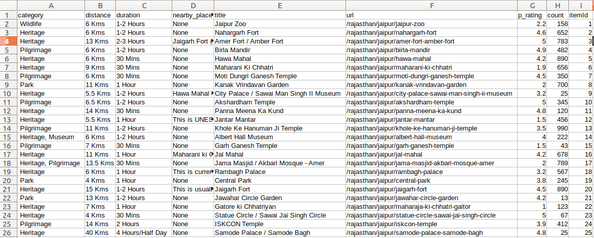
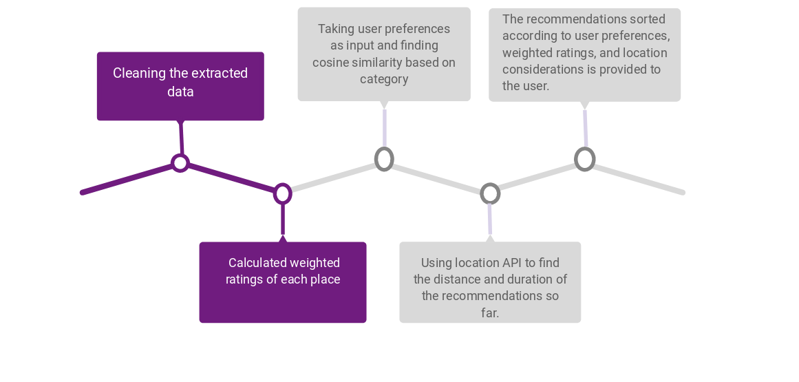
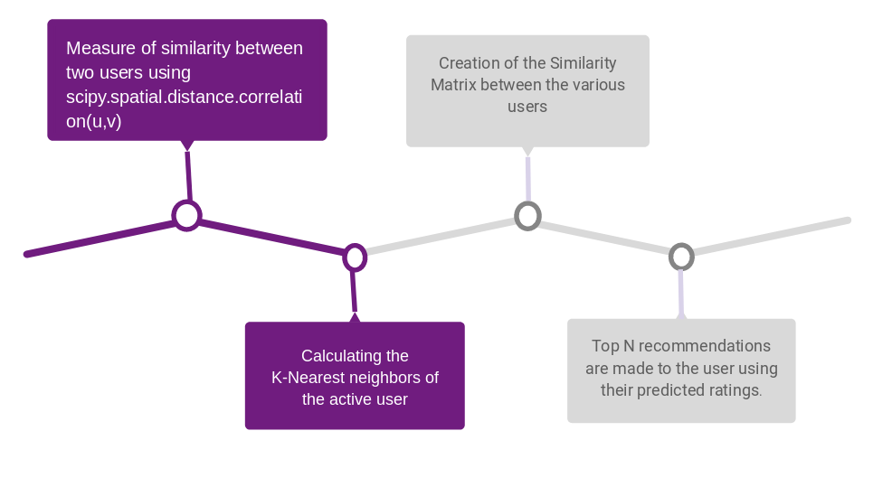

# Tourist-Recommender-System

## Description
Aim to develop a personalized travel planning system that simultaneously considers all categories of user requirements and provides users with a travel schedule planning service.This will enable the user in finding what they are looking for, easily without spending time and effort.

## Procedure

- Dataset Extraction
- Content Based Filtering-
1. Cosine Similarity
2. Weighted Ratings
3. Location API
- Collaborative Filtering-
1. Similarity between users- correlation
2. K-Nearest Neighbour
- Dataset used-
1. data_collaborative - this has the userId, the itemId, the rating and the date that rating was given
2. data_content - this has the itemId, title, category, p_rating etc.

#### Dataset Extraction
- Web Scraping - technique employed to extract large amounts of data from websites whereby the data is extracted and saved to a local file
- Scrapy - Python framework used to efficiently extract data from websites
- Extracted the data of best tourist places in Jaipur from https://www.trawell.in/rajasthan/jaipur/places-to-visit-things-to-do
- Dataset contains title ,category, distance(from railway station), duration, nearby places, rating etc

#### Content Based Filtering
Content-based filtering is used to calculate a degree of similarity between the users and the items to be recommended. The process is carried out by comparing the features of the item with respect to the user’s preferences. 

#### Collaborative Filtering
Collaborative filtering techniques are recommendation methods based on the opinions of a set of users.The methods based on items predict the interest of the user on an activity a considering the evaluation that this user has given to similar activities

 

